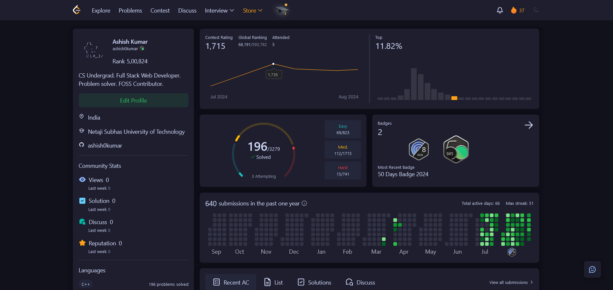
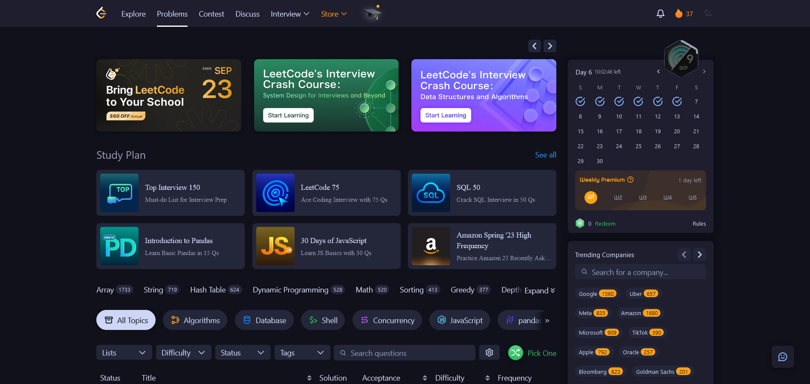
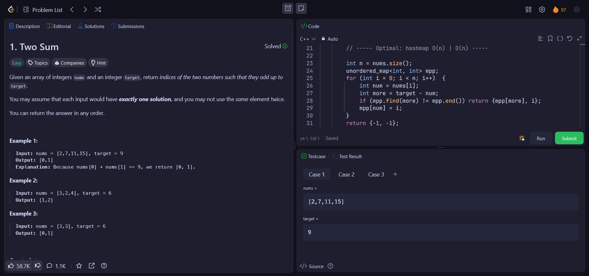

<h2 align="center">
	 
	
  Catppuccin for <a href="https://leetcode.com">LeetCode</a>
	
</h2>

	
	

 

	  
  	  
  	  

## 🚀 Installation
You have to install [Stylus](https://add0n.com/stylus.html) and then click on the install link below.   

## 🤝 Contributions
Any contribution is greatly appreciated.

## 💝 Current Maintainer
- [ashish0kumar](https://github.com/ashish0kumar)

## 📜 License
Code released under the [MIT](LICENSE) license.

&nbsp;

	

	Copyright &copy; 2021-present <a href="https://github.com/catppuccin" target="_blank">Catppuccin Org</a>

